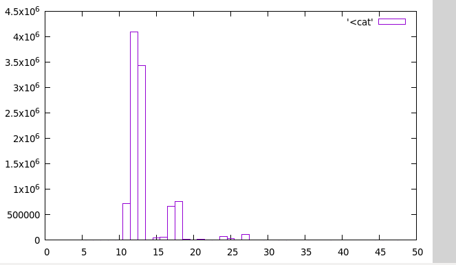
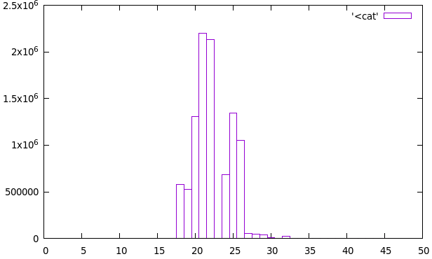
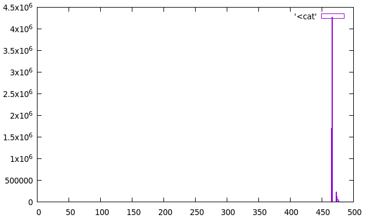

# SVAR

## TASK A
- With sleep() it uses Real: 1.001s, User: 0.000, Sys: 0.001
    - No user time because the program starts and request sleep to the system scheduler. The scheduler removes the program from the stack and adds it after the sleep period. The system overhead is 0.001 hence the total time is 1.001
- With busy_wait() it uses Real: 1.001s, User: 1.001, Sys: 0.000
    - With busy_wait() the program is running and using the processor throughout the program and is never removed from stack by the system scheduler. The 0.001 overshoot could be caused by the resolution of the busy_wait() function (for loop 0 -> 10000)
- With busy_wait_times() the program uses Real: 1.001s, User: 0.880, Sys: 0.120
    - In this case the program uses system time while retrieving time. It finishes at 1.001 because of program overhead and timer resolution due to the for loop.

## TASK B
- __rdtsc() uses 13-14 ms ish. Res: 1/(2.66*10^9) s

- clock_gettime() uses 23 ms ish. Res: nanosec

- times() has a resolution at 1/100 of a second. It is not possible to use the timer itself to time latency

## TASK C
- Scheduler uses 485 ns for context switch

